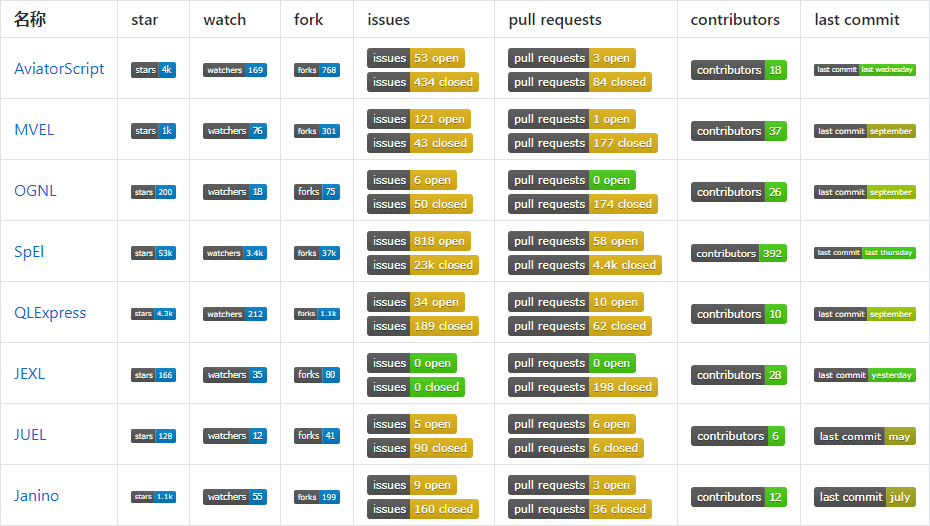
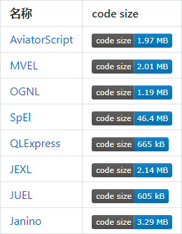
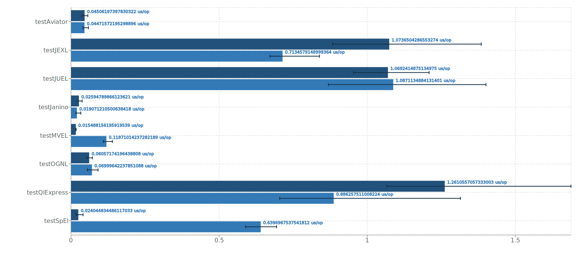
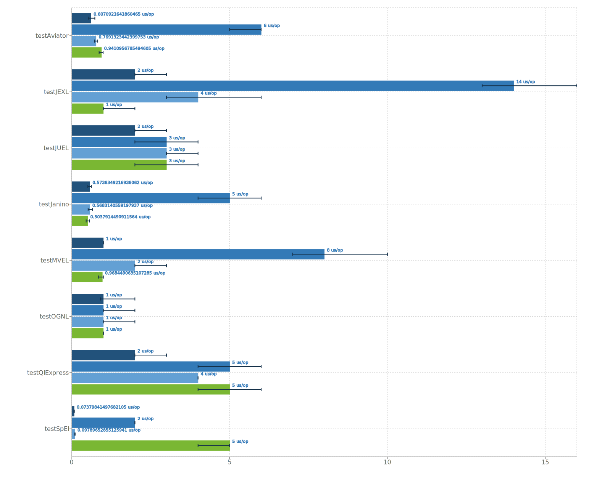
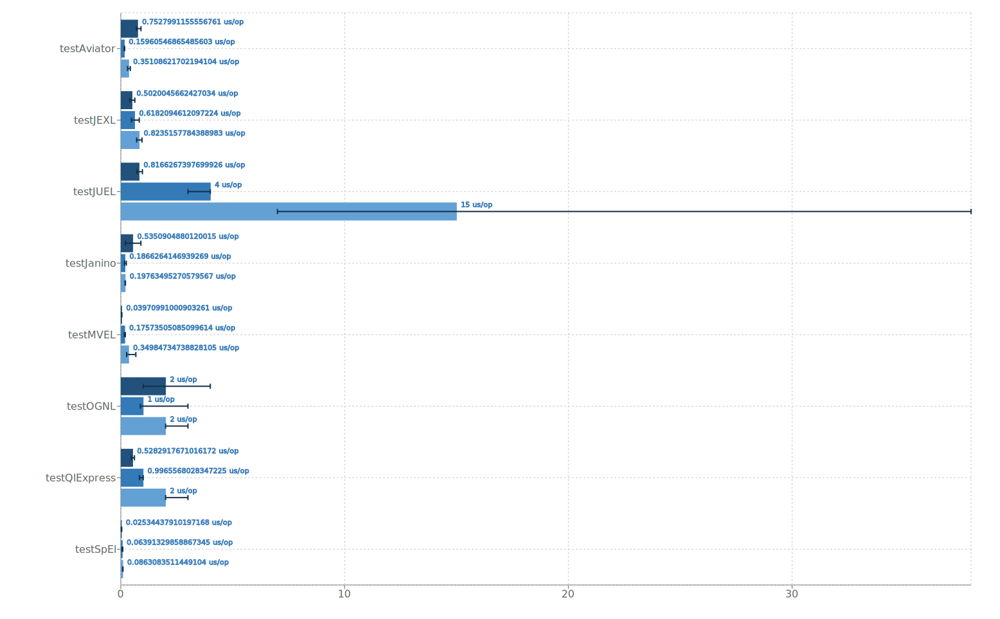

# 表达式引擎比较

## 简介

表达式引擎的使用非常广泛，涵盖了许多不同的领域和应用，用于处理和计算各种类型的表达式和规则。具体来说主要有以下使用场景：

* 公式计算：表达式引擎可以用于解析和计算复杂的数学或逻辑公式。
* 数据转换和处理：在数据集成和ETL（Extract, Transform, Load）过程中，表达式引擎可以用于解析和转换数据，执行数据清洗、映射和转换等操作。
* 动态业务规则：表达式引擎可以处理需要灵活配置且不断变更的动态业务规则，解析和评估规则条件，以确定是否满足规则的触发条件，并执行相应的操作。

下面将针对 [AviatorScript][Aviator]、[MVEL][MVEL]、[OGNL][OGNL]、[SpEL][Spring]、[QLExpress][QLExpress]、[JEXL][JEXL]、[JUEL][JUEL] 几种常见表达式引擎进行比较。先简单介绍一下这几种表达式引擎。

### [AviatorScript][Aviator]

AviatorScript 是一门高性能、轻量级寄宿于 JVM 之上的脚本语言。AviatorScript 可将表达式编译成字节码。2010年作者在淘宝中间件负责Notify内部消息中间件时开发并开源。

文档：https://www.yuque.com/boyan-avfmj/aviatorscript

### [MVEL (MVFLEX Expression Language)][MVEL]

MVEL是一种混合的动态/静态类型的、可嵌入Java平台的表达式语言，MVEL被众多Java项目使用。MVEL 在很大程度上受到 Java 语法的启发，但也有一些本质区别，目的是使其作为一种表达式语言更加高效，例如直接支持集合、数组和字符串匹配的操作符，以及正则表达式。最早版本发布于2007年。

文档：http://mvel.documentnode.com/

### [OGNL (Object-Graph Navigation Language)][OGNL]

OGNL 是 Object-Graph Navigation Language（对象图导航语言）的缩写；它是一种表达式语言，用于获取和设置 Java 对象的属性，以及其他额外功能，如列表投影和选择以及 lambda 表达式。于2005年发布2.1.4版。

文档：https://commons.apache.org/dormant/commons-ognl/language-guide.html

### [SpEL (Spring Expression Language)][Spring]

是一种功能强大的表达式语言，支持在运行时查询和操作对象图。该语言的语法与 Unified EL 相似，但提供了更多的功能，其中最主要的是方法调用和基本的字符串模板功能。2009年随 Spring 3 发布。

文档：https://docs.spring.io/spring-framework/docs/5.3.x/reference/html/core.html#expressions

### [QLExpress][QLExpress]

由阿里的电商业务规则、表达式（布尔组合）、特殊数学公式计算（高精度）、语法分析、脚本二次定制等强需求而设计的一门动态脚本引擎解析工具。在阿里集团有很强的影响力，同时为了自身不断优化、发扬开源贡献精神，于2012年开源。

文档：https://github.com/alibaba/QLExpress

### [JEXL (Java Expression Language)][JEXL]

JEXL 是一个库，旨在促进在 Java 编写的应用程序和框架中实现动态和脚本功能。 JEXL 基于对 JSTL 表达式语言的一些扩展实现了一种表达式语言，支持 shell 脚本或 ECMAScript 中的大部分构想。1.0版发布于2005年。

文档：https://commons.apache.org/proper/commons-jexl/reference/syntax.html

### [JUEL (Java Unified Expression Language)][JUEL]

JUEL 是统一表达式语言 (EL) 的实现，该语言是 JSP 2.1 标准 (JSR-245) 的一部分，已在 JEE5 中引入。此外，JUEL 2.2 实现了 JSP 2.2 维护版本规范，完全符合 JEE6 标准。于2006年发布2.1.0版本，2.2.7发布于2014年。

文档：https://juel.sourceforge.net/guide/start.html

### [Janino][Janino]

Janino是一个超小、超快的Java编译器，也可以用作表达式引擎，它的性能非常出色，根据官网介绍Apache Spark、Apache Flink、Groovy等优秀的开源项目都在用Janino。

文档：http://janino-compiler.github.io/janino/

由于Janino实际是一个Java编译器，理论上其性能应该接近于直接执行Java代码，其次作为表达式引擎使用比较复杂。下面的测试中，Janino不参与比较，可以将其作为一个参照。

规则引擎如 Drools， urule，easy-rules 不参与此次比较。相对比较成熟完善的脚本语言如Groovy也不参与比较。

## 技术栈选型评估

接下来将从社区情况、引入的大小和依赖、性能、安全性和使用案例几个方面对几种表达式引擎进行评估。

### 社区

社区活跃度可以辅助评估项目的健康度，有问题是不是能及时解决，项目是不是能持续演进等等，下面列出了GitHub star，watch，fork，last commit等数据，可以作为参考，由于数据随着时间推移会产生变化，以下仅针对2023.10.7的数据进行分析。

由于 Spring 项目被广泛使用，而SpEl又是Spring的一个子项目，所以各项数据SpEl是最活跃的。下面先排除SpEl分析其他几个表达式引擎。

QLExpress，AviatorScript 和 MVEL 在国内使用比较多，这可能是他们star，watch，fork数较高的原因。说明这几个项目受欢迎度，受认可度，影响力应该较高。

从issues，pull requests数来分析，可以看到 MVEL，AviatorScript 和 QLExpress 高于其他脚本引擎，说明他们的用户需求和反馈较多，也可能意味着项目面临较多问题和挑战。

MVEL，JEXL，OGNL 均有较多贡献者参与。他们的社区协作、项目可持续性方面应该都比较不错。

综合以上分析，除SpEl外，QLExpress，AviatorScript 和 MVEL 的社区活跃度都相对较高。

以下是2023.10.7的数据



以下是实时数据

| 名称                       | star                                                                                       | watch                                                                                       | fork                                                                                  | issues                                                                                                                                                                                        | pull requests                                                                                                                                                                                                     | contributors                                                                                        | last commit                                                                                                      |
|--------------------------|--------------------------------------------------------------------------------------------|---------------------------------------------------------------------------------------------|---------------------------------------------------------------------------------------|-----------------------------------------------------------------------------------------------------------------------------------------------------------------------------------------------|-------------------------------------------------------------------------------------------------------------------------------------------------------------------------------------------------------------------|-----------------------------------------------------------------------------------------------------|------------------------------------------------------------------------------------------------------------------|
| [AviatorScript][Aviator] |          |          |          |                   |                   |          |          |
| [MVEL][MVEL]             |                         |                         |                         |                                                 |                                                 |                         |                         |
| [OGNL][OGNL]             |                   |                   |                   |                                     |                                     |                   |                   |
| [SpEl][Spring]           |  |  |  |   |   |  |  |
| [QLExpress][QLExpress]   |                 |                 |                 |                                 |                                 |                 |                 |
| [JEXL][JEXL]             |               |               |               |                             |                             |               |               |
| [JUEL][JUEL]             |                      |                      |                      |                                           |                                           |                      |                      |
| [Janino][Janino]         |            |            |            |                       |                       |            |            |

### 大小和依赖

代码大小和依赖可以辅助评估代码的复杂性，下面列出了各个Github仓库的代码大小，可以作为一个参考（实际并不完全准确反应其实现的复杂性）。

以下是2023.10.7的数据



以下是实时数据

| 名称                       | code size                                                                                               | 
|--------------------------|---------------------------------------------------------------------------------------------------------|
| [AviatorScript][Aviator] |          |
| [MVEL][MVEL]             |                         |
| [OGNL][OGNL]             |                   |
| [SpEl][Spring]           |  |
| [QLExpress][QLExpress]   |                 |
| [JEXL][JEXL]             |               |
| [JUEL][JUEL]             |                      |
| [Janino][Janino]         |            |

JUEL，QLExpress代码大小最小，都在600多KB；其次是 OGNL 1MB多一点；AviatorScript，MVEL，JEXL 大小都在2MB左右；SpEl由于在 spring-framework 仓库中，上表中统计的是 spring-framework 的总量，单纯看 SpEl 的模块 spring-expression 的话，大小是1.3MB左右。但是其还依赖了 spring-core 和 spring-jcl，再含这两个的话，大小 7.4MB左右。

我们再结合各个项目的依赖来分析一下。

```
+- org.mvel:mvel2:jar:2.5.0.Final:compile
+- com.googlecode.aviator:aviator:jar:5.3.3:compile
+- com.alibaba:QLExpress:jar:3.3.1:compile
|  +- commons-beanutils:commons-beanutils:jar:1.8.2:compile
|  |  \- (commons-logging:commons-logging:jar:1.1.1:compile - omitted for conflict with 1.2)
|  \- commons-lang:commons-lang:jar:2.4:compile
+- org.codehaus.janino:janino:jar:3.1.10:compile
|  \- org.codehaus.janino:commons-compiler:jar:3.1.10:compile
+- ognl:ognl:jar:3.4.2:compile
|  \- org.javassist:javassist:jar:3.29.2-GA:compile
+- org.apache.commons:commons-jexl3:jar:3.3:compile
|  \- commons-logging:commons-logging:jar:1.2:compile
+- org.springframework:spring-expression:jar:5.3.29:compile
|  \- org.springframework:spring-core:jar:5.3.29:compile
|     \- org.springframework:spring-jcl:jar:5.3.29:compile
+- de.odysseus.juel:juel-api:jar:2.2.7:compile
+- de.odysseus.juel:juel-impl:jar:2.2.7:compile
+- de.odysseus.juel:juel-spi:jar:2.2.7:compile
```

除了SpEl外，QLExpress，OGNL，JEXL都有其他依赖。

如果考虑 commons-beanutils， commons-lang， commons-logging 三个依赖，QLExpress 引入的大小在 10MB左右。

如果考虑 javassist 依赖，OGNL 引入的大小是4MB多。

如果考虑 commons-logging 依赖，JEXL 引入的大小是2.5MB左右。

综合来看，JUEL，AviatorScript，MVEL，JEXL 在引入大小和依赖方面要好于其他。

### 性能

较好的性能意味着系统能够快速地响应用户的请求，减少等待时间，提升体验。

性能方面主要通过 JMH 在字面量表达式、含有变量的表达式以及含有方法调用的表达式等使用场景对几个表达式引擎进行测试。

JMH（Java Microbenchmark Harness），是用于代码微基准测试的工具套件，主要是基于方法层面的基准测试，精度可以达到纳秒级。该工具是由 Oracle 内部实现 JIT 的大牛们编写的，他们应该比任何人都了解 JIT 以及 JVM 对于基准测试的影响

由于不同表达式引擎语法或特性稍有差别，下面测试中对于差异项会进行说明。

#### 字面量表达式



1.  `1000 + 100.0 * 99 - (600 - 3 * 15) / (((68 - 9) - 3) * 2 - 100) + 10000 % 7 * 71`
2.  `6.7 - 100 > 39.6 ? 5 == 5 ? 4 + 5 : 6 - 1 : !(100 % 3 - 39.0 < 27) ? 8 * 2 - 199 : 100 % 3`

说明：

由于QlExpress执行第2个表达式时报错，实际执行的是 `6.7 - 100 > 39.6 ? (5 == 5 ? 4 + 5 : 6 - 1) : (!(100 % 3 - 39.0 < 27) ? 8 * 2 - 199 : 100 % 3)`

结果分析:

可以明显看到 JEXL，JUEL，QlExpress这三个表达式引擎性能明显不如其他引擎。

SpEl 在执行第1个算数操作时表现出色，但是在执行第2个嵌套三元操作时明显不如AviatorScript，MVEL，OGNL引擎。

此轮测试中 AviatorScript，OGNL，MVEL表现出色。AviatorScript，OGNL 执行两个表达式表现都比较出色，其中AviatorScript略好于OGNL。 MVEL 在执行第1个算数操作时表现最出色，但是在执行第2个嵌套三元操作时慢于AviatorScript，OGNL引擎。

#### 含有变量的表达式



1.  `pi * d + b - (1000 - d * b / pi) / (pi + 99 - i * d) - i * pi * d / b`
2.  `piDecimal * dDecimal + bDecimal - (1000 - dDecimal * bDecimal / piDecimal) / (piDecimal + 99 - iDecimal * dDecimal) - iDecimal * piDecimal * dDecimal / bDecimal`
3.  `i * pi + (d * b - 199) / (1 - d * pi) - (2 + 100 - i / pi) % 99 == i * pi + (d * b - 199) / (1 - d * pi) - (2 + 100 - i / pi) % 99`
4.  `(clientVersion == '1.9.0' || clientVersion == '1.9.1' || clientVersion == '1.9.2') && deviceType == 'Xiaomi' && weight >= 4 && osVersion == 'Android 9.0' && osType == 'Android' && clientIp != null && requestTime <= now&& customer.grade > 1 && customer.age > 18`

说明：

* 由于QlExpress执行第3个表达式时报错，实际执行的是 `i * pi + (d * b - 199) / (1 - d * pi) - (int)(2 + 100 - i / pi) % 99 == i * pi + (d * b - 199) / (1 - d * pi) - (int)(2 + 100 - i / pi) % 99`
* 由于AviatorScript执行第4个表达式时报错，实际执行的是 `(clientVersion == '1.9.0' || clientVersion == '1.9.1' || clientVersion == '1.9.2') && deviceType == 'Xiaomi' && weight >= 4 && osVersion == 'Android 9.0' && osType == 'Android' && clientIp != nil && requestTime <= now&& customer.grade > 1 && customer.age > 18`
* 由于不同的表达式引擎在执行第2个表达式时底层实现除法时有所差别，MVEL，AviatorScript，JEXL 执行 `decimal.divide(otherDecimal, java.math.MathContext.DECIMAL128)` ，其他实际执行的是`decimal.divide(otherDecimal, scale, roundingMode)`只是参数略有不同，分析时应该分组进行。

结果分析：

第1个基本类型包装类的算术计算 SpEl 最优。其次是AviatorScript，MVEL，OGNL。JEXL，JUEL，QlExpress则不如其他引擎。

第2个BigDecimal类型的算术计算。由于底层实现不同，分为两组。第1组 MVEL，AviatorScript，JEXL，AviatorScript 优于 MVEL 优于 JEXL。第2组 JUEL，QlExpress，OGNL，SpEl，性能由优到差依次是 OGNL，SpEl，JUEL，QlExpress。并且第1组由于精度更高，性能明显差于第2组。

第3个含有基本类型包装类算数计算的布尔表达式。SpEl 最优，AviatorScript 次之，接下来依次是 OGNL, MVEL，JUEL，JEXL，QlExpress。

第4个含有字符串比较的布尔表达式。AviatorScript，JEXL，MVEL，OGNL 性能明显优于 JUEL，QlExpress，SpEl。

#### 含有方法调用的表达式



1.  `new java.util.Date()`
2.  `s.substring(b.d)`
3.  `s.substring(b.d).substring(a, b.c.e)`

说明：

* 由于 JUEL 执行`new java.util.Date()`时报错，本轮实际执行的是自定义函数`fn:date()`
* 由于 AviatorScript 执行`s.substring`时报错，本轮实际执行的是其内部函数`string.substring`

结果分析：

此轮测试中 SpEl 的表现最优，甚至比Janino还要快。MVEL，AviatorScript次之，在执行构造方法时MVEL要好于AviatorScript。JEXL 表现也比较出色。JUEL，OGNL，QlExpress这三个表达式引擎则不如其他引擎。

#### 总结

综合以上测试结果，AviatorScript，SpEl，MVEL，OGNL性能表现相对较好。

AviatorScript 性能相对较好，表现均衡，但其语法相较其他引擎跟Java的差异略大。

SpEl 除了在个别场景下性能较差，大部分场景表现也非常出色，尤其是在算数计算（字面量和含有变量），方法调用场景下。

MVEL 性能表现相对均衡，含有变量的算术计算略差于AviatorScript，其在字面量算术计算，方法调用场景下表现都非常出色。

OGNL 性能表现也相对均衡，但方法调用场景下表现不佳。

### 安全

安全性方面主要通过漏洞披露、安全指南和配置比较几种表达式引擎。

#### 漏洞

首先在 https://cve.mitre.org/cve/search_cve_list.html 通过关键字搜索的方式粗略了解一下不同表达式引擎被公开的漏洞。这种方式可能不是非常的准确，由于不同表达式引擎的使用场景、使用方式、关注度的不同可能导致被公开的漏洞存在差异。比如我们所熟悉的 OGNL、SpEl 的关键字出现在漏洞中的频率明显高于其他表达式引擎。OGNL 在[MyBatis][mybatis]和[Struts][struts] 中被使用，SpEl则在[Spring][Spring]中被广泛使用，这两个表达式引擎又被大部分项目间接使用，直接将用户输入作为表达式的一部分执行，很容易导致出现漏洞。

我们可以从这些公布的漏洞中了解不同表达式引擎可能存在的安全隐患及其修复情况，在使用过程中尽可能避免出现类似问题。

不推荐将表达式执行直接开放到不可信的环境，如果确实需要，应该详细了解选择的表达式引擎，是否提供了必要的设置选项可以避免某些安全隐患。

| 名称                       | 关键字链接                                                          | 漏洞数 |
|--------------------------|----------------------------------------------------------------|-----|
| [AviatorScript][Aviator] | https://cve.mitre.org/cgi-bin/cvekey.cgi?keyword=AviatorScript | 1   |
| [MVEL][MVEL]             | https://cve.mitre.org/cgi-bin/cvekey.cgi?keyword=MVEL          | 4   |
| [OGNL][OGNL]             | https://cve.mitre.org/cgi-bin/cvekey.cgi?keyword=OGNL          | 28  |
| [SpEl][Spring]           | https://cve.mitre.org/cgi-bin/cvekey.cgi?keyword=SpEl          | 10  |
| [QLExpress][QLExpress]   | https://cve.mitre.org/cgi-bin/cvekey.cgi?keyword=QLExpress     | 0   |
| [JEXL][JEXL]             | https://cve.mitre.org/cgi-bin/cvekey.cgi?keyword=JEXL          | 3   |
| [JUEL][JUEL]             | https://cve.mitre.org/cgi-bin/cvekey.cgi?keyword=JUEL          | 1   |

#### 安全设置

AviatorScript，QLExpress，JEXL均从不同程度提供了一些安全选项设置。

##### AviatorScript

* 设置白名单

    ```java
    // 在new语句和静态方法调用中允许使用的类白名单 默认 null 表示无限制
    AviatorEvaluator.setOption(Options.ALLOWED_CLASS_SET, Sets.newHashSet(List.class));
    // 在new语句和静态方法调用中允许使用的类白名单 包含子类 默认 null 表示无限制
    AviatorEvaluator.setOption(Options.ASSIGNABLE_ALLOWED_CLASS_SET, Sets.newHashSet(List.class));
    ```

* 防止死循环

    ```java
    // 循环最大次数 默认 0 表示无限制
    AviatorEvaluator.setOption(Options.MAX_LOOP_COUNT, 10000);
    ```

* 特性开关

    ```java
    // 关闭某些特性
    AviatorEvaluator.getInstance().disableFeature(Feature.Module);
    AviatorEvaluator.getInstance().disableFeature(Feature.NewInstance);
    // 只开启需要的特性
    AviatorEvaluator.setOption(Options.FEATURE_SET, Feature.asSet(Feature.If));
    ```

##### QLExpress

* 开启沙箱模式

    ```java
    QLExpressRunStrategy.setSandBoxMode(true);
    ```

  在沙箱模式中，不可以：

    * import Java 类
    * 显式引用 Java 类，比如 `String a = 'mmm'`
    * 取 Java 类中的字段：`a = new Integer(11); a.value`
    * 调用 Java 类中的方法：`Math.abs(12)`

  可以：

    * 使用 QLExpress 的自定义操作符/宏/函数，以此实现与应用的受控交互
    * 使用. 操作符获取 Map 的 key 对应的 value，比如 a 在应用传入的表达式中是一个 Map，那么可以通过 a.b 获取
    * 所有不涉及应用 Java 类的操作

* 设置白名单

    ```java
    // 设置编译期白名单
    QLExpressRunStrategy.setCompileWhiteCheckerList(Arrays.asList(
        // 精确设置
        CheckerFactory.must(Date.class),
        // 子类设置
        CheckerFactory.assignable(List.class)
    ));
    
    // 设置运行时白名单
    // 必须将该选项设置为 true
    QLExpressRunStrategy.setForbidInvokeSecurityRiskMethods(true);
    // 有白名单设置时, 则黑名单失效
    QLExpressRunStrategy.addSecureMethod(RiskBean.class, "secureMethod");
    ```

* 设置黑名单

    ```java
    // 必须将该选项设置为 true
    QLExpressRunStrategy.setForbidInvokeSecurityRiskMethods(true);
    // 这里不区分静态方法与成员方法, 写法一致
    // 不支持重载, riskMethod 的所有重载方法都会被禁止
    QLExpressRunStrategy.addSecurityRiskMethod(RiskBean.class, "riskMethod");
    ```
  QLExpess 目前默认添加的黑名单有：

    * java.lang.System.exit
    * java.lang.Runtime.exec
    * java.lang.ProcessBuilder.start
    * java.lang.reflect.Method.invoke
    * java.lang.reflect.Class.forName
    * java.lang.reflect.ClassLoader.loadClass
    * java.lang.reflect.ClassLoader.findClass

* 防止死循环

    ```java
    //可通过timeoutMillis参数设置脚本的运行超时时间:1000ms
    Object r = runner.execute(express, context, null, true, false, 1000);
    ```

##### JEXL

* 使用沙箱

    ```java
    // 使用中应该通过JexlSandbox的重载构造方法进行配置
    new JexlBuilder().sandbox(new JexlSandbox()).create();
    ```

* 设置白名单权限

    ```java
    new JexlBuilder().permissions(JexlPermissions.RESTRICTED.compose("io.github.howiefh.*")).create();
    ```

* 特性开关

    ```java
    // 关闭循环、new 实例，import等特性
    new JexlBuilder().features(new JexlFeatures().loops(false).newInstance(false).importPragma(false)).create();
    ``` 
  
### 语法

接下来从类型、操作符、控制语句、集合、方法定义几方面比较一下不同表达式引擎的语法设计。

类型方面，AviatorScript 设计了独特的类型，使用时需要注意其类型转换的优先级long->bigint->decimal->double。AviatorScript、MVEL、OGNL、JEXL都支持BigInteger、BigDecimal字面量，这意味着进行精确计算时可以使用字面量，将更方便。此外AviatorScript、QLExpress都支持高精度计算的设置项。

操作符方面，QLExpress支持替换、自定义操作符及操作符别名，这可能有助于简化复杂表达式或使表达式更加直观，不过添加预置函数应该可以达到差不多的效果。AviatorScript也支持自定义部分操作符，不过支持数量相当有限。AviatorScript、SpEl、JEXL支持正则匹配操作符。

控制语句方面，除OGNL、SpEl、JUEL不支持控制语句外，其他都支持，不过需要注意 AviatorScript 的 `else if` 语法有些特殊写作 `elsif`，foreach语句跟Java也有所不同。

集合方面，除JUEL外其他都提供了快捷定义的方式，只不过语法不同。

函数定义方面，SpEl、JUEL均不支持，OGNL支持伪lambda定义，其他都支持定义函数。QLExpress不支持定义lambda。

综合来看，和Java语法都或多或少存在一些差异。AviatorScript设计了自己特有的一些语法，使用的话需要熟悉一下。QLExpress支持自定义操作符，可以使表达式看起来更直观。MVEL、JEXL的语法可能更接近Java，让人更容易接受一些。OGNL、SpEl、JUEL的语法更简单一些，不支持控制语句和函数定义，当然也可以通过预置一些函数变通解决一些较复杂的问题。

### 使用案例

业界使用情况可以分析不同表达式引擎的可行性、生态和整合性，以及最佳实践。从下表可以看到AviatorScript，MVEL，QLExpress在国内业务线均有使用案例，有些企业也有文章输出，我们可以借鉴使用。

| 名称                       | 案例                                                                                  | 
|--------------------------|-------------------------------------------------------------------------------------|
| [AviatorScript][Aviator] | [美团酒旅实时数据规则引擎应用实践][meituan]，[liteflow][liteflow]                                    |
| [MVEL][MVEL]             | [Pick！闲鱼亿级商品库中的秒级实时选品][xianyu]， [easy-rules][easy-rules]，[compileflow][compileflow] |
| [OGNL][OGNL]             | [MyBatis][mybatis]，[Struts][struts]                                                 |
| [SpEl][Spring]           | [Spring][Spring]                                                                    |
| [QLExpress][QLExpress]   | [compileflow][compileflow]，[liteflow][liteflow]，阿里内部业务线                             |
| [JEXL][JEXL]             | [cat][cat]，Jelly                                                                    |
| [JUEL][JUEL]             | JSP                                                                                 |
| [Janino][Janino]         | Apache Spark、Apache Flink、Groovy                                                    |


## 选型建议

社区方面，SpEl无疑是最活跃的。AviatorScript，QLExpress则在国内很受欢迎，AviatorScript 主要由其作者一人维护，QLExpress 则有阿里背书。

代码大小和依赖方面，AviatorScript，MVEL 依赖少，并且代码大小也偏小。

性能方面，如果你使用表达式引擎执行字面量算术计算或方法调用偏多可以选用SpEl，MVEL。如果希望整体性能表现较好可以选用 AviatorScript。

安全方面，如果想自定义安全选项，可以考虑 AviatorScript，QLExpress和JEXL。

语法方面，可能存在一些主观因素，仅供参考，个人觉得MVEL、JEXL的语法设计使用起来会更容易一些。

使用案例方面，AviatorScript，MVEL，QLExpress在国内都有实际使用案例可循。

[Aviator]: https://github.com/killme2008/aviatorscript
[MVEL]: https://github.com/mvel/mvel
[OGNL]: https://github.com/orphan-oss/ognl
[Spring]: https://github.com/spring-projects/spring-framework
[QLExpress]: https://github.com/alibaba/QLExpress
[JEXL]: https://github.com/apache/commons-jexl
[JUEL]: https://github.com/beckchr/juel
[Janino]: https://github.com/janino-compiler/janino
[meituan]: https://tech.meituan.com/2018/04/19/hb-rt-operation.html
[xianyu]: https://www.infoq.cn/article/yglagc7z0t-stzx11foe
[liteflow]: https://github.com/dromara/liteflow
[easy-rules]: https://github.com/j-easy/easy-rules
[compileflow]: https://github.com/alibaba/compileflow
[struts]: https://github.com/apache/struts
[struts]: https://github.com/apache/struts
[mybatis]: https://github.com/mybatis/mybatis-3
[cat]: https://github.com/dianping/cat